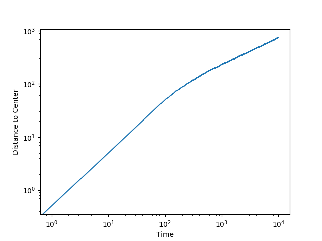

# extremeDiffusion1D
Simulations of the 1D Barraquand-Corwin model for extreme diffusion. The costly
functions are written in C++ and then ported to Python using [PyBind11](https://github.com/pybind/pybind11).

## File Structure
* cDiffusion

  Contains the C++ algorithms to actually run the simulations and port to Python
  with PyBind11.

* examples

  A couple example simulations using the cDiffusion module.

* analysis

  Analysis for all the experiments that have been run. Each folder is generally
  a different experiment.

* src

  Wrapper classes for the C++/PyBind11 class defined in cDiffusion/diffusion.cpp
  and recurrenceRelation/recurrance.cpp. Also contains a lot of helper functions
  for easier analysis. This is generally what should be imported into Python
  versus the base C++/PyBind11 class.

* test

  Contains some tests to make sure the recurranceRelation module matches what the
  native python version that Eric wrote.

* recurranceRelation

  Contains C++ implementation of Ivan's recurrence relation ported into python
  with PyBind11.

* runFiles

  Files to run experiments on Locust using SLURM.

# Installation and Setup
There are only two steps needed to setup the library and start running simulations

1. [Install Pybind11](https://pybind11.readthedocs.io/en/stable/installing.html)

  What we've done in the past is just clone the PyBind11 repository to the same
  local directory as the extremeDiffusion1D folder. Since PyBind11 is a header
  only file I don't recall there being any installation process besides that.

2. Compile the cDiffuion/diffusion.cpp file

  Since we're using PyBind11 to interface Python with the C++ code you can't
  simply use `g++ -o <outfile> diffusion.cpp`. The Pybind11 compilation is somewhat
  lengthy as we have to make our compiler aware that we want to compile to a Python
  library with Pybind11 but this is taken care of with the /cDiffusion/diffusion.cpp
  file. To do this, run in a terminal:

  ```
  cd extremeDiffusion1D/cDiffusion
  ./compile.sh
  ```

  If it runs successfully it should make a diffusion.so and diffusion.hpp.gch
  file.

3. Install [Numpy_Quad](https://github.com/SimonsGlass/numpy_quad)

## Importing to Python
  After compiling the library need to add the cDiffuion folder to your Python
  path or you can use a hack around this by adding the folder to your path at the
  beginning of each script. Paste the code block below to the beginning of a
  script to import the base C++/Pybind11 class.

  ```python
  import sys
  # The path needs to point to the cDiffusion folder. This can be done relative
  # to the script you're running or with an absolute path.
  sys.path.append('./extremeDiffusion1D/cDiffuion')
  import diffusion
  ```

  To import the Python helper class you need to add the src and cDiffusion folder
  to your Python path. Therefore, you can use:

  ```python
  import sys
  sys.path.append('./extremeDiffusion1D/cDiffuion')
  sys.path.append('./extremeDiffusion1D/src')
  import pydiffusion
  ```

# Examples

```python
import sys
sys.path.append('../cDiffuion')
sys.path.append('../src')
import pydiffusion as diff
import matplotlib
matplotlib.use('Agg')
from matplotlib import pyplot as plt

# Specify some constants like the number of particles, beta, and number of
# timesteps to evolve the system
N = 1e50
beta = 1
num_of_timesteps = 10_000

# Initialize the system with parameters and other key word arguments
d = diff.Diffusion(N, beta=beta, occupancySize=num_of_timesteps, smallCutoff=0,
                   largeCutoff=0, probDistFlag=False)

# Evolve the system to the specified number of timesteps
d.evolveToTime(num_of_timesteps)

# Get the rightmost edge and the time
maxEdge = d.maxDistance
time = d.center * 2

# Plot the edge over time and save
fig, ax = plt.subplots()
ax.set_xlabel('Time')
ax.set_ylabel('Distance to Center')
ax.set_xscale('log')
ax.set_yscale('log')
ax.plot(time, maxEdge)
fig.savefig('MaxEdge.png')
```

